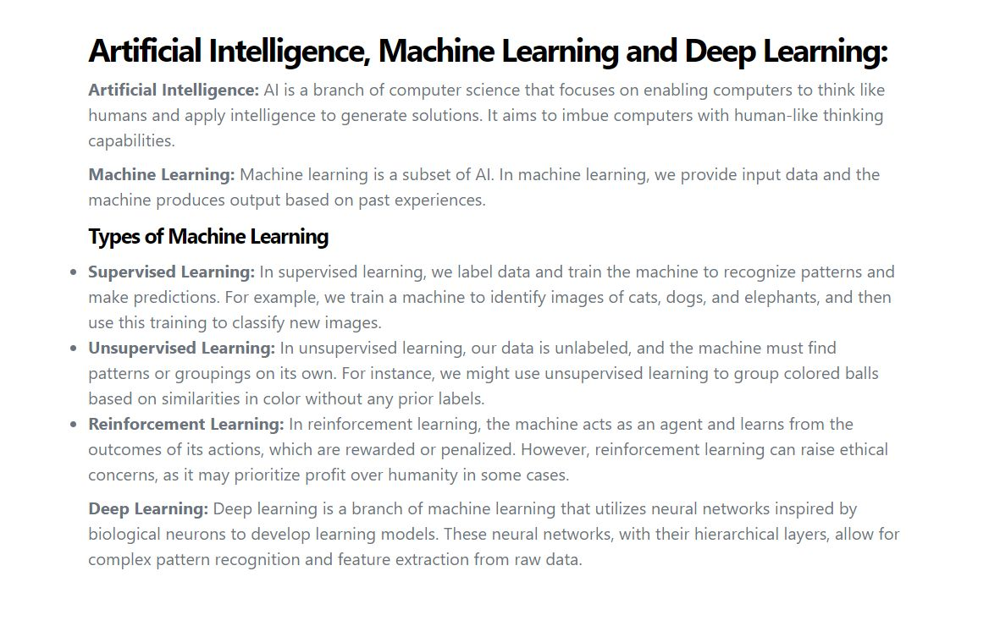
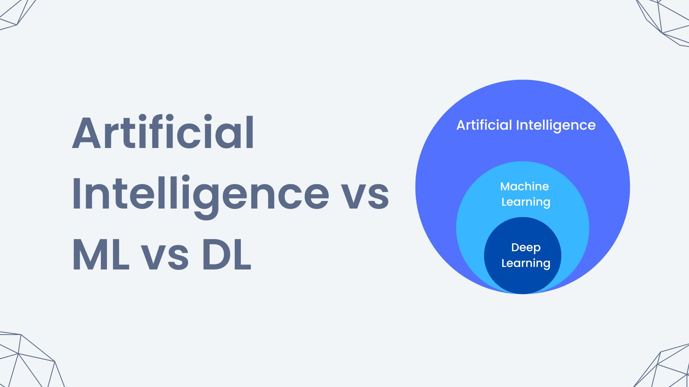

# Differentiate between AI, machine learning, deep learning, generative AI, and applied AI.

### Artificial Intelligence (AI)
Artificial Intelligence is like giving a computer a brain so it can do smart things, like a human.
* Uses: Helping you with tasks, like answering questions or playing games.
*   Example: Google Assistant that answers your questions and helps you with reminders.
### Machine Learning (ML)
Machine Learning is a way for computers to learn new things by looking at lots of examples, just like how you learn from practice.
* Uses: Teaching computers to recognize patterns or make decisions based on data.
*  Example: An app that can guess your favorite color based on the colors you choose in the past.
### Deep Learning (DL)
Deep Learning is a type of ML that uses a very special kind of computer brain with many layers to understand really complex things.
* Uses: Recognizing things in pictures or understanding speech.
*   Example: A photo app that can tell if a picture has a cat or a dog in it.
### Generative AI
Generative AI creates new things, like pictures or stories, by learning from examples.
* Uses: Making new images, writing stories, or creating music.
*  Example: A tool that can draw a new picture of a unicorn based on what it has learned from many unicorn pictures.
### Applied AI 
Applied AI is using AI to solve real-world problems or make our lives easier.
* Uses: Helping with tasks in everyday life, like making recommendations or improving safety.
*   Example: A smart speaker that plays music you like or a robot vacuum that cleans your room by itself.
 # OR

## Note:
In summary, AI is the overarching field, ML is a subset of AI that involves learning from data, DL is a subset of ML focusing on deep neural networks, Generative AI deals with creating new content, and Applied AI is about utilizing AI technologies in practical scenarios.
