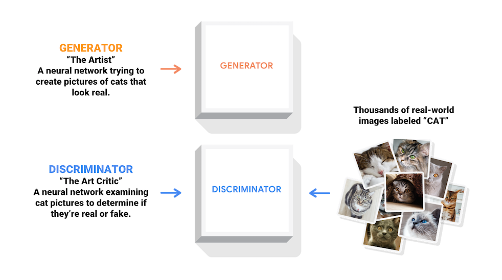

# What are GANs?

Generative Adversarial Networks (GANs) are one of the most interesting ideas in computer science today. Two models are trained simultaneously by an adversarial process. A generator ("the artist") learns to create images that look real, while a discriminator ("the art critic") learns to tell real images apart from fakes.

During training, the generator progressively becomes better at creating images that look real, while the discriminator becomes better at telling them apart. The process reaches equilibrium when the discriminator can no longer distinguish real images from fakes.

## Below is a Step-by-Step Explanation of How GANs Work:

### Step 1: Initialize Generator and Discriminator
- **Generator**: This network generates synthetic data (images, text, etc.) from random noise. Its objective is to create data that resembles the real dataset.
- **Discriminator**: This network distinguishes between real data (from the dataset) and synthetic data (from the generator). Its objective is to classify real vs. fake data accurately.

### Step 2: Create Random Noise Input for Generator
- The process starts with a random noise vector (commonly drawn from a normal or uniform distribution) fed into the generator.

### Step 3: Generate Synthetic Data
- The generator uses this noise as input to generate a sample (fake data) that mimics the real data. Initially, this generated data will be far from the actual data distribution.

### Step 4: Train the Discriminator
- The discriminator is fed both real data (from the dataset) and fake data (generated by the generator). The discriminator then classifies each input as real or fake.
- The loss function for the discriminator penalizes it for incorrectly classifying real and fake data.

### Step 5: Update Discriminator Weights
- Backpropagation is used to update the discriminator's weights to improve its ability to distinguish real data from fake data. The goal of the discriminator is to maximize the probability of correctly identifying real vs. fake data.

### Step 6: Train the Generator
- Now, the generator's goal is to "fool" the discriminator into classifying its fake data as real.
- The loss function for the generator is based on how well it fools the discriminator. If the discriminator classifies the generated data as real, the generator performs well.

### Step 7: Update Generator Weights
- Using the discriminator's feedback, the generator's weights are updated to improve the quality of its generated data, using backpropagation through the combined generator-discriminator model.

### Step 8: Repeat the Process
- Both networks are trained in an adversarial loop:
  - The discriminator becomes better at distinguishing real from fake.
  - The generator becomes better at producing realistic data.

### Step 9: Convergence
- Over multiple iterations, the generator improves to the point where the discriminator can no longer distinguish between real and generated data, meaning the GAN has reached a point where the generated data is highly realistic.

## Key Points:
- **Adversarial Process**: The generator and discriminator compete against each other, which helps improve their performance.
- **Loss Functions**: 
  - The discriminator aims to maximize its ability to distinguish real from fake.
  - The generator aims to minimize its failure in fooling the discriminator.
- **Training Stability**: GANs can be unstable to train and require careful tuning of hyperparameters, architectures, and techniques like Wasserstein GAN or label smoothing to stabilize training.

This process continues until the generator can create data so realistic that the discriminator can't tell the difference between real and generated data.

  # OR 
## Understanding GANs
A GAN, or Generative Adversarial Network, is like a game between two AI models where they try to outsmart each other

GANs consist of two main components:

- **Generator**: The Generator’s job is to create data that resembles real data. It starts by generating random noise and attempts to transform it into a plausible data sample, such as an image, that looks like it could come from a real dataset.

- **Discriminator**: The Discriminator’s role is to distinguish between real data (from the actual dataset) and fake data (produced by the Generator). It acts like a critic, evaluating whether the input it receives is genuine or not.

### How GANs Work: A Step-by-Step Process

1. **Initial Training**:
   - The Discriminator is trained with real data, so it learns to identify the patterns and features of genuine data.
   - The Generator, on the other hand, starts with no real knowledge and produces random data.

2. **Generating Fake Data**:
   - The Generator creates an image (or other data forms) using its current understanding, which is initially very basic and unrealistic.

3. **Discriminator’s Evaluation**:
   - The Discriminator receives a mix of real data and the Generator’s fake data. Its job is to correctly identify which data is real and which is fake.

4. **Feedback Loop**:
   - Based on the Discriminator's evaluation, the Generator receives feedback. If the Discriminator easily spots the fake data, the Generator adjusts its strategy to produce more realistic data in the next iteration.

5. **Continuous Improvement**:
   - Over many iterations, the Generator becomes more sophisticated, producing data that increasingly resembles real data. Meanwhile, the Discriminator keeps improving its ability to differentiate between real and fake data.

6. **End Goal**:
   - The ultimate goal is for the Generator to produce data so realistic that the Discriminator can no longer tell the difference between real and fake. At this point, the Generator has effectively learned to mimic the real data distribution.

### Example: GAN in Action

Let’s take an example of generating realistic-looking images of human faces.

- **Generator’s Role**: Imagine the Generator as an artist who is trying to draw a portrait of a person without ever seeing the person. Initially, the portraits are rough and don’t resemble a real person.

- **Discriminator’s Role**: The Discriminator is like an art critic who has seen many real portraits. It looks at the Generator's drawings and compares them with real portraits. It then decides whether the new portrait looks real or not.

- **Learning Process**: The Generator keeps refining its technique based on the Discriminator’s feedback. Over time, the Generator improves, and its portraits start looking more like real human faces. The Discriminator also keeps learning, but at some point, the Generator becomes so good that the Discriminator struggles to tell the difference.

### GANs Loss Functions

Both the Generator and the Discriminator use loss functions to measure their performance:

- **Generator Loss**: This measures how well the Generator is fooling the Discriminator. A lower loss means the Generator is producing more realistic data.
- **Discriminator Loss**: This measures how accurately the Discriminator is distinguishing between real and fake data. A lower loss means the Discriminator is good at its job.

The two models are trained simultaneously, with the Generator trying to minimize its loss and the Discriminator trying to maximize the Generator’s loss while minimizing its own.
